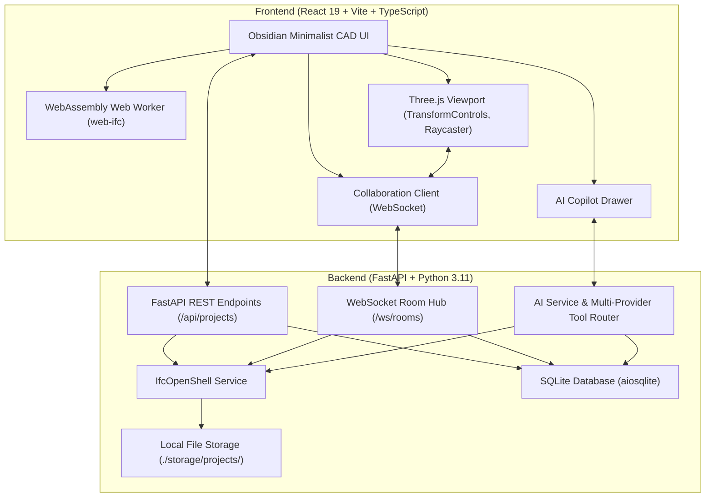

# IFC Editor — Autonomous Full-Stack OpenBIM Application

A high-performance, real-time collaborative OpenBIM web application for inspecting, modifying, and authoring Industry Foundation Classes (`.ifc`) building models. Designed with an ultra-clean **Obsidian Minimalist** aesthetic (deep graphite `#0d0f12`, slate `#16191f`, hairline `#262a33` borders) inspired by Linear and Raycast.

---

## 🌟 Key Features

1. **Lightweight 3D WebGL Engine & WebAssembly Web Worker**
   - Built on Three.js and `web-ifc` WebAssembly engine running in a **dedicated background Web Worker**.
   - Zero-copy transferable buffers keep the main UI thread completely responsive at 60fps.
   - Categorized architectural materials (Walls, Slabs, Columns, Doors, Windows) with silhouette edge highlighting on selection.

2. **Interactive 3D Spatial Transformations (Gizmo)**
   - Three.js `TransformControls` with Translate, Rotate, and Scale modes.
   - Configurable grid and angle snapping (`0.5m / 15°`).
   - Automatically synchronizes transformations back to backend IFC relative placements (`IfcLocalPlacement`, `IfcAxis2Placement3D`) via `ifcopenshell`.

3. **Property Set (Pset) Inspector & Editing**
   - Live numeric 3D position and rotation readout.
   - Inspects all IFC attributes, Property Sets (`Pset_WallCommon`, etc.), and quantities (Net Volume, Gross Area, Length).
   - In-place editing of property values (Boolean, Integer, Real, Label) persisted directly to the active `.ifc` file.

4. **Advanced BIM Inspection Suite**
   - **Orthogonal Section Planes**: Interactive clipping along X, Y, and Z axes with invert normal capability.
   - **3D Measurement Ruler**: Click-to-measure vertex-to-vertex 3D vector distances with real-time distance readouts.
   - **Camera Presets & View Modes**: Orthographic Top, Front, Side, and Isometric views; Solid, Wireframe, and X-Ray transparency styles.

5. **Real-Time Collaboration & Concurrency**
   - Multi-user FastAPI WebSocket rooms (`/ws/rooms/{project_id}`) with live user presence and color-coded avatar stack.
   - **Interactive Soft-Locking**: Selecting or editing an element acquires a temporary soft-lock on its `expressID`, preventing edit conflicts.
   - 60fps live transform matrix streaming across connected users with lerp interpolation.

6. **Multi-Provider AI Copilot with Tool Calling**
   - Natural language OpenBIM assistant accessible via the Copilot drawer.
   - Supports:
     - **Google Gemini**: `gemini-3.8-flash` (default), `gemini-3.8-pro`, `gemini-3.5-pro`
     - **Anthropic Claude**: `claude-3-7-sonnet`, `claude-3-5-sonnet`
     - **OpenAI**: `gpt-4o`, `gpt-4.5`, `o3-mini`
     - **Ollama / Local LLM**: Configurable base URL (e.g. `http://localhost:11434/v1`)
     - **Built-in Deterministic Engine**: 100% offline, zero-key tool execution
   - **Autonomous Tool Executions**:
     - `generate_building(specs)`: Parametrically generates multi-storey buildings with storeys, floor slabs, perimeter walls, and structural columns.
     - `transform_element(element_id, dx, dy, dz, rx, ry, rz)`: Moves or rotates elements by delta offsets.
     - `update_property(element_id, pset_name, property_name, value)`: Updates or adds property sets.
     - `query_model(query_type, filters)`: Queries element counts, storeys, and entity statistics.

7. **Bundled Architectural Sample Models & IFC Export**
   - 1-click onboarding templates:
     - **Duplex Residential Villa**: 2-storey residential villa with ground floor, first floor, partition walls, floor slabs, columns, and property sets.
     - **Modern Architectural Pavilion**: Open-span commercial pavilion featuring cantilever canopy roof, structural grid columns, and glass enclosure facades.
   - Full IFC Export: Generates 100% compliant IFC files preserving all updated geometry placements and modified properties.

---

## 🏗️ Architecture



---

## 🚀 Quick Start

### Prerequisites
- **Windows / Linux / macOS**
- **Python 3.11+**
- **Node.js 18+** & **pnpm**

### 1. Launch with One Command (Windows PowerShell)
```powershell
.\start.ps1
```
This script automatically:
1. Validates the Python 3.11 virtual environment (`backend/venv`).
2. Installs required Python and Node dependencies if missing.
3. Launches the FastAPI backend on `http://127.0.0.1:8000`.
4. Launches the Vite development server on `http://localhost:5173`.

### 2. Manual Startup

**Backend:**
```bash
cd backend
python -m venv venv
# Windows
.\venv\Scripts\activate
# Linux/macOS
source venv/bin/activate

pip install -r requirements.txt
uvicorn backend.app.main:app --host 127.0.0.1 --port 8000 --reload
```

**Frontend:**
```bash
cd frontend
pnpm install
pnpm run dev
```

Open `http://localhost:5173` in your browser.

---

## 🧪 Deterministic Quality Gates & Automated Tests

Run the complete verification suite with pytest and TypeScript compiler:

```bash
# Run backend test suite (Phase 1, Phase 3, Phase 5, Phase 6, Phase 7)
.\backend\venv\Scripts\pytest backend/tests/ -v

# Run frontend type check and production bundle
cd frontend
pnpm exec tsc --noEmit
pnpm run build
```

---

## 📂 Project Structure

```
├── backend/
│   ├── app/
│   │   ├── api/               # REST and WebSocket endpoints
│   │   │   ├── copilot.py     # AI Copilot endpoints (/api/copilot/chat)
│   │   │   ├── health.py      # System health and diagnostics
│   │   │   ├── projects.py    # Project CRUD, upload, export, samples
│   │   │   └── websocket.py   # Real-time multi-user WebSocket room hub
│   │   ├── core/              # Config and SQLite database initialization
│   │   ├── models/            # Pydantic schemas and data contracts
│   │   ├── samples/           # Bundled architectural IFC sample models
│   │   └── services/          # Business logic
│   │       ├── ai_service.py  # Multi-provider tool execution engine
│   │       ├── ifc_service.py # IfcOpenShell BIM operations
│   │       ├── project_service.py # Project lifecycle & audit trail
│   │       └── websocket_manager.py # Multi-user room manager & locks
│   └── tests/                 # Automated pytest test suites
├── frontend/
│   ├── src/
│   │   ├── components/
│   │   │   ├── copilot/       # AI Copilot drawer & settings modal
│   │   │   ├── modals/        # New project, sample loader, and upload modals
│   │   │   ├── properties/    # Property Inspector & Pset editor
│   │   │   ├── toolbar/       # Top navigation, project status, collaborator avatars
│   │   │   ├── tools/         # Section planes, measurement ruler, camera views
│   │   │   ├── tree/          # Spatial hierarchy tree navigator
│   │   │   └── viewer/        # Three.js 3D viewport & TransformControls
│   │   ├── services/          # REST and WebSocket collaboration clients
│   │   ├── types/             # TypeScript type definitions
│   │   └── workers/           # Dedicated WebAssembly worker (web-ifc)
│   └── public/
│       └── web-ifc.wasm       # Static WebAssembly binary asset
├── storage/                   # Project models and SQLite database
├── ROADMAP.md                 # Autonomous phase-lock roadmap
└── start.ps1                  # Single native runner script
```
